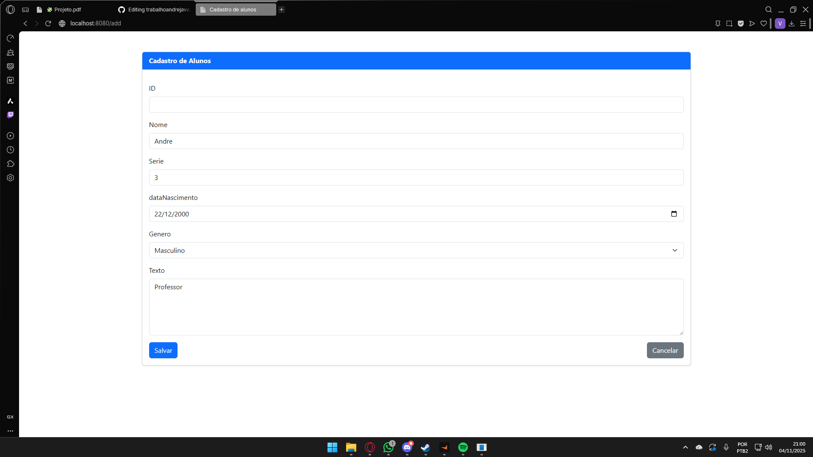
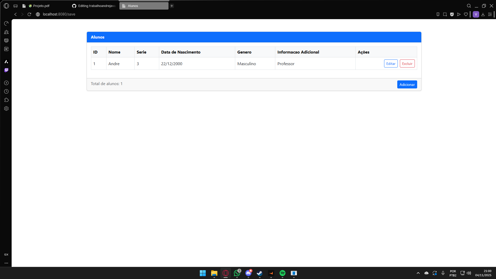
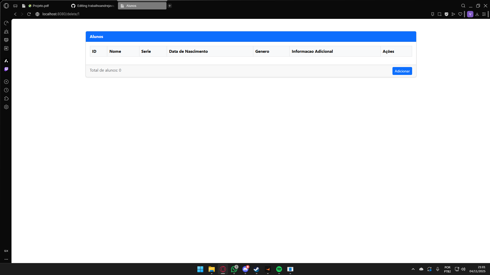

Trabalho / Prova | Andre 

## 📚 Descrição # - Repositório para armazenar resumos sobre o trabalho de Java lecionado pelo professor André 
# - Nesse trabalho podemos realizar a gestão de cadastro de alunos, sendo possivel editar e até mesmo excluir 

## 📚 Documentação # - Para iniciar o projeto devemos acionar o botão adicionar # - Devemos inserir os dados solicitados pelo navegador
# - Após inserir os dados, eles são apresentados na tela. Após a apresentação, será possivel editar ou excluir a aplicação

# - Tela Inicial

# - Adicionar Aluno      

# - Botão Editar 

# - Aluno Editado

# - Botão Excluir

# - Usuario Excluido

